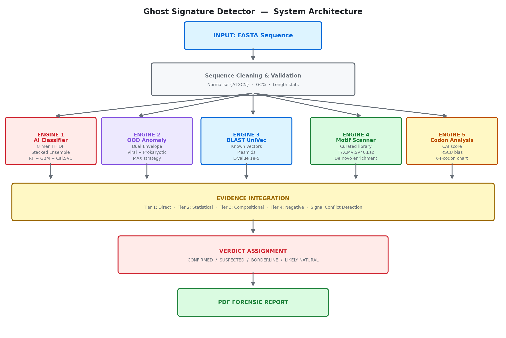

# 🧬 Ghost Signature Detector: AI-Powered Biosecurity 🛡️

**Ghost Signature Detector** is a forensic genomic surveillance suite designed to identify synthetic DNA backbones and "silent" lab-manipulated sequences. It utilizes a multi-layered detection strategy to catch both **Known Threats** (Database matches) and **Emerging Threats** (AI-detected structural anomalies).

---

## 🚀 The Core Challenge
Modern biosecurity faces a significant "Detection Gap":
1.  **Database Reliance:** Traditional tools only find what they already know. 
2.  **Machine Rhythm:** Engineered DNA displays a **"Ghost Signature"**—a low-entropy, hyper-optimized pattern caused by *in-silico* design (codon optimization) that differs fundamentally from **Wild-Type** evolutionary noise.

This tool bridges the gap by providing a **3-Tier Forensic Verdict**.

---

## 🛠️ Forensic Methodology

The system generates a **Genomic Forensic Map** by analyzing three distinct layers of evidence:

### 1. Database Homology (Tier 1)
* **Engine:** BLASTn + UniVec/Laboratory Vector Database.
* **Evidence:** Identifies direct "copy-paste" segments from known industrial plasmids and vectors.

### 2. Structural AI Analysis (Tier 2)
* **Engine:** Random Forest Classifier + TF-IDF Vectorization (k=8).
* **Evidence:** Detects the **"Machine Rhythm"** of the sequence. It flags sequences that lack stochastic evolutionary noise, identifying synthetic designs even when database matches are zero.

### 3. K-mer Complexity/Shannon Entropy (Tier 3)
* **Engine:** Real-time Shannon Entropy Calculation.
* **Evidence:** Quantifies informational diversity. Synthetic sequences often show **"Entropy Dips"**—localized drops in complexity where a machine has optimized the genetic code for industrial expression.

---
## 🧬 System Architecture

  

  

## 📊 3-Tier Classification System

| Classification | Homology | AI Risk | Interpretation |
| :--- | :--- | :--- | :--- |
| **Confirmed Engineered** | ✅ Found | High | Direct match to known lab vectors. |
| **Suspected Engineered** | ❌ None | **High/Mid** | **Ghost Signature detected.** Pattern matches machine design. |
| **Fully Natural** | ❌ None | Low | **Wild-Type.** High-entropy, natural evolutionary noise. |

---

## 📈 Visualizing the Evidence

The tool generates a high-resolution **Genomic Forensic Map** for every sample, featuring:
* **The Backbone:** A spatial reference frame of the total sequence length.
* **Risk Heatmap:** A color-coded intensity map of synthetic risk across the genome.
* **Complexity Graph:** A Shannon Entropy plot to identify machine-optimized segments.

---
