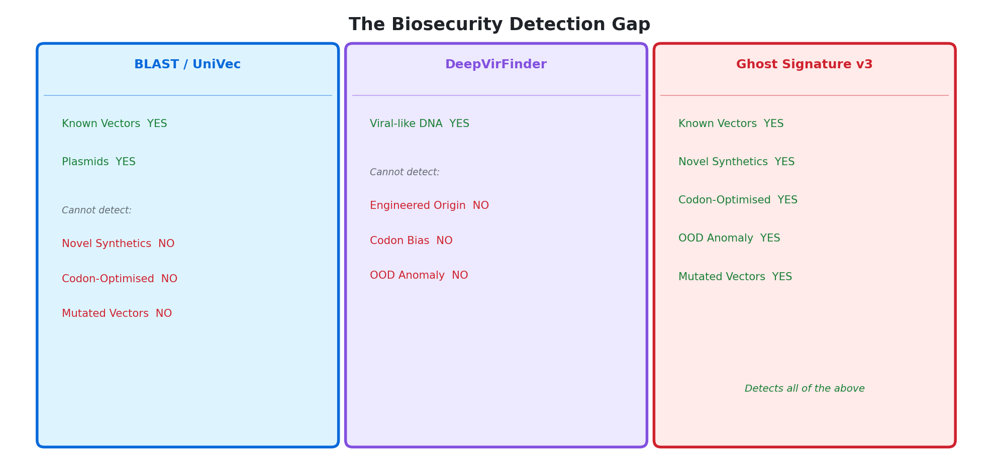
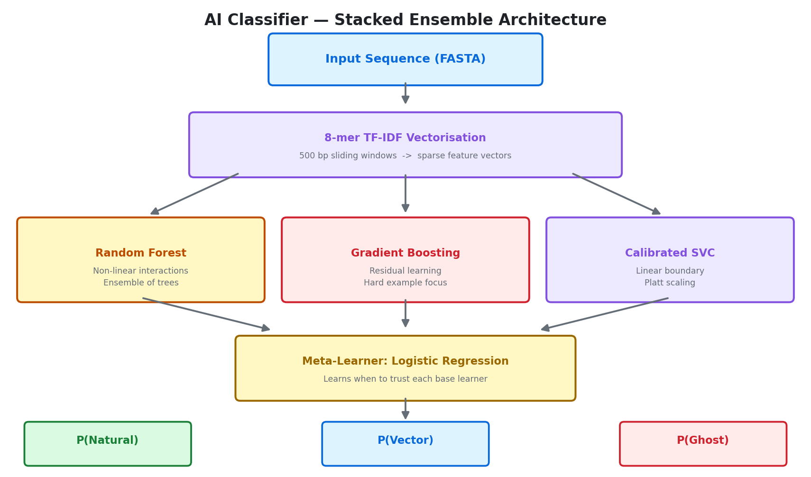
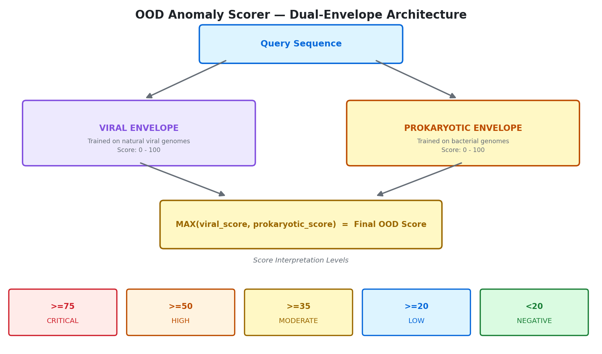
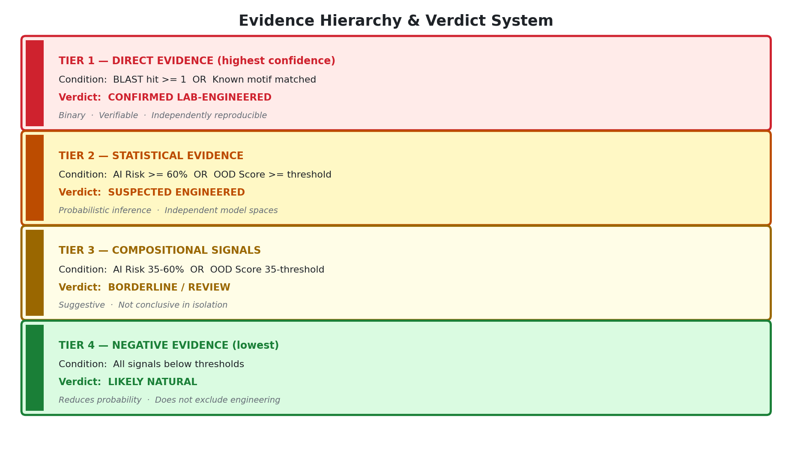
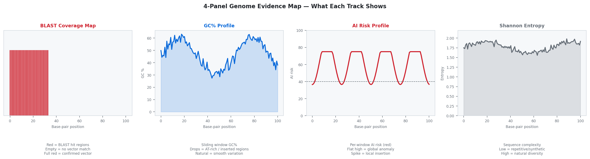
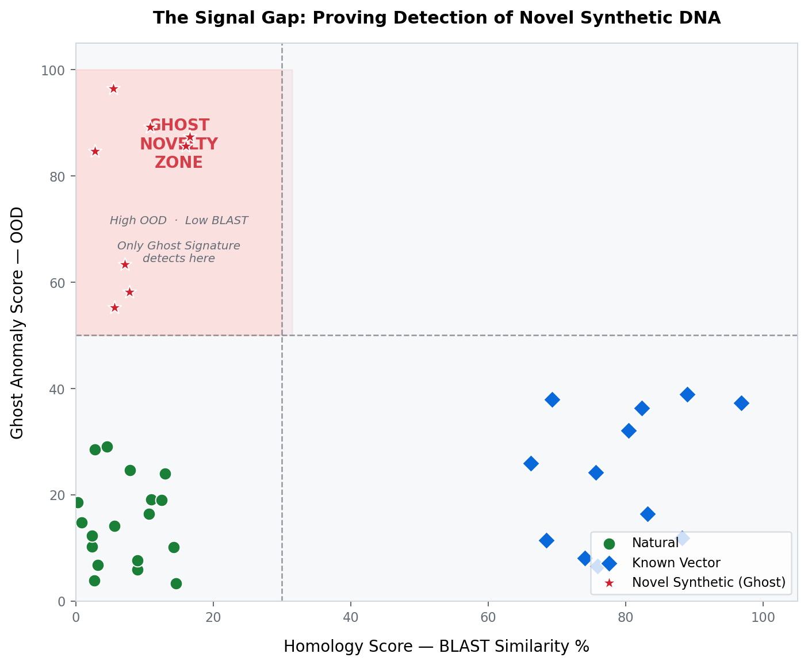

<div align="center">

# 🧬 Ghost Signature Detector `v3.0🛡️`
### *Forensic Genomic Intelligence for the Synthetic Age*

<br>

[](https://www.python.org/)
[](https://scikit-learn.org/)
[](https://biopython.org/)
[](https://pyfpdf.readthedocs.io/)
[](#)
[](LICENSE)

<br>

> ***"Detecting the undetectable. Bridging the gap between natural evolution and synthetic design."***

<br>

---

</div>

## 🌐 What is Ghost Signature?

As DNA synthesis technology becomes cheaper and more accessible, the ability to **print custom genetic code** has outpaced our ability to verify its origin. Natural organisms evolve through billions of years of random mutation, leaving behind a rich, noisy, unpredictable genetic fingerprint. In contrast, lab-engineered sequences are *designed* — mathematically optimised, logically structured, and statistically anomalous compared to anything evolution would produce.

This hidden pattern is the **Ghost Signature**: a low-entropy, hyper-optimised imprint left behind by in-silico design that standard biosecurity tools are architecturally blind to.

**Ghost Signature Detector v3** is a multi-engine forensic genomics platform that finds these patterns across **five independent detection layers**, combining classical bioinformatics, supervised machine learning, unsupervised anomaly detection, codon-level statistical analysis, and regulatory motif scanning into a single unified forensic verdict — delivered as a publication-ready PDF report.

<br>

---

## 🚨 The Detection Gap — Why Existing Tools Are Not Enough

<p align="center">
  
</p>

The fundamental problem: a sequence engineered to be *novel* — designed from scratch or codon-optimised until unrecognisable — leaves **zero BLAST hits** yet carries a clear synthetic signature in its statistical properties. Ghost Signature v3 is designed specifically to operate in this blind spot.

<br>

---

## ⚙️ System Architecture — Five Independent Detection Engines

<p align="center">
  
</p>

<p align="center">
  <a href="https://zamiljahid.github.io/ghost_signature_AI/architecture.html">
    
  </a>
</p>

The system integrates five orthogonal detection engines. No single engine is sufficient — each has a characteristic blind spot. Multi-engine convergence dramatically reduces both false positive and false negative rates across all sequence types.

<br>

---

## 🔬 Detection Engine Deep Dive

### Engine 1 — AI Classifier (k-mer Machine Learning)

<p align="center">
  
</p>

The sequence is decomposed into overlapping **8-mer (octamer)** fragments using a sliding window and transformed via **TF-IDF vectorisation** — suppressing common uninformative k-mers and amplifying discriminative synthetic signatures. The classifier is a **3-class stacked ensemble**: Random Forest, Gradient Boosting, and Calibrated Linear SVC as base learners, combined by a Logistic Regression meta-learner.

**Output Classes:**

| Class | Description |
|---|---|
| 🌿 Natural | Wild-type viral or bacterial sequence |
| 🧪 Vector | Known cloning plasmid or expression construct |
| 👻 Ghost | Novel synthetic — no database match, but engineered |

---

### Engine 2 — Out-of-Distribution (OOD) Anomaly Scorer

<p align="center">
  
</p>

The key innovation: a sequence can be *novel* without being in any database, yet it will still be *statistically anomalous* relative to any natural genome. The OOD scorer operates unsupervised — asking not *"which class does this belong to?"* but *"does this sequence fall within the statistical distribution of any natural genome?"*

Two independent envelopes are maintained — one trained on viral genomes, one on bacterial genomes. The final score is the **maximum** across both, ensuring a synthetic sequence cannot hide by partially resembling one training domain.

---

### Engine 3 — BLAST Homology Screening

Direct database search against the **NCBI UniVec** database. A confirmed BLAST hit constitutes **Tier 1 direct evidence** — the highest confidence class. Absence of a BLAST hit does not indicate natural origin; novel synthetics leave zero hits by design.

---

### Engine 4 — Regulatory Motif Scanner

Exact substring matching against a curated library of known laboratory control elements:

| Motif | Sequence | Function |
|---|---|---|
| T7 Promoter | `TAATACGACTCACTATAGGG` | In vitro transcription |
| CMV Promoter Core | `TGACATTGATTATTGACTAG` | Mammalian expression |
| SV40 Poly-A Signal | `AATAAAATATCTTTATTTTC` | mRNA termination |
| Kanamycin Resistance | `ATGAGCCATATTCAACGGGA` | Antibiotic selection |
| Ampicillin Resistance | `ATGAATTCACTGGCCGTCGT` | Antibiotic selection |
| Lac Operator | `AATTGTGAGCGGATAACAATT` | E. coli expression control |
| M13 Reverse Primer | `CAGGAAACAGCTATGAC` | Sequencing primer site |
| M13 Forward Primer | `GTAAAACGACGGCCAGT` | Sequencing primer site |

Additionally, de novo **k-mer enrichment analysis** compares query k-mer frequencies against a natural background corpus. Fold-enrichment > 10x is flagged.

---

### Engine 5 — Codon Optimisation Analysis

The most powerful evasion technique in synthetic biology: changing DNA sequence while preserving protein identity. Ghost Signature is one of very few tools that detects this.

```
Natural Gene                     Codon-Optimised Version
     │                                    │
     ▼                                    ▼
CAI  ~  0.4-0.55               CAI  >  0.65       ← FLAGGED
RSCU bias  ~  0.2          RSCU bias  >  0.45      ← FLAGGED
BLAST hits:  many            BLAST hits:  ZERO
Protein:  identical          Protein:  identical
                                          │
                               Ghost Signature detects it ✅
```

<br>

---

## 🏛️ Evidence Hierarchy & Verdict System

<p align="center">
  
</p>

Ghost Signature implements a **formal four-tier evidence hierarchy**. Direct BLAST evidence always takes precedence over statistical inference. Signal conflict detection actively reports when engines disagree, preventing falsely confident verdicts.

| Conflict Type | Trigger | Meaning |
|---|---|---|
| **AI–OOD Conflict** | High AI + Low OOD | Known vector fitting natural k-mer stats, or cross-domain sequence |
| **Short Fragment Flag** | Sequence < 300 bp | k-mer stats unreliable; BLAST and motifs take priority |
| **Convergent Evidence** | Multiple engines agree | Strong multi-signal confirmation of synthetic origin |

<br>

---

## 📊 Four-Verdict Classification System

| Verdict | Trigger | Confidence |
|---|---|---|
| 🔴 **CONFIRMED LAB-ENGINEERED** | BLAST hit OR known motif | Definitive |
| 🟠 **SUSPECTED ENGINEERED** | AI >= 60% AND OOD >= 5.0 | High |
| 🟡 **BORDERLINE / REVIEW** | AI >= 35% AND OOD >= 2.0 | Moderate |
| 🟢 **LIKELY NATURAL** | All below thresholds | High |

<br>

---

## 📈 Forensic PDF Report

Every analysis produces a **multi-page publication-ready PDF**. The report includes a colour-coded verdict banner, executive summary, multi-signal evidence analysis, sequence properties, AI classifier probabilities, OOD dual-envelope table, BLAST hit summary, regulatory motif results, codon optimisation analysis, and the full spatial visualisation suite.

### 📊 4-Panel Genome Evidence Map

<p align="center">
  
</p>

### 🎯 The Signal Gap Plot — Core Novelty Visualisation

<p align="center">
  
</p>

The Signal Gap is a 2D scatter plot mapping each sequence by its BLAST similarity (x-axis) and OOD anomaly score (y-axis). Sequences in the **top-left Ghost Novelty Zone** are simultaneously unmatched in any vector database AND statistically anomalous relative to all natural genomes. **This zone is uniquely accessible only through Ghost Signature.**

<br>

---

## 🆚 Comparison with Existing Tools

| Capability | Ghost Sig. v3 | BLAST/UniVec | DeepVirFinder | DeePaC | k-mer Only |
|---|:---:|:---:|:---:|:---:|:---:|
| Detects known vectors | ✅ | ✅ | Partial | Partial | Partial |
| Detects novel synthetics | ✅ | ❌ | Partial | Partial | Partial |
| Codon optimisation detection | ✅ | ❌ | ❌ | ❌ | ❌ |
| OOD anomaly scoring | ✅ | ❌ | ❌ | ❌ | ❌ |
| Dual-envelope architecture | ✅ | ❌ | ❌ | ❌ | ❌ |
| K-mer saliency / position map | ✅ | ❌ | ❌ | ❌ | ❌ |
| Signal conflict detection | ✅ | ❌ | ❌ | ❌ | ❌ |
| Three-class classification | ✅ | ❌ | ❌ | ❌ | ❌ |
| Auto interpretable PDF report | ✅ | ❌ | ❌ | ❌ | ❌ |
| Works without database match | ✅ | ❌ | ✅ | ✅ | ✅ |

<br>

---

## 🧪 Validated Test Cases

### ✅ True Positives — Confirmed Lab-Engineered

| Sequence | Length | BLAST Hits | AI Risk | OOD | Verdict |
|---|---|---|---|---|---|
| pUC19 Fragment | 240 bp | 390 (100% ID) | 100% | 20.0 | 🔴 CONFIRMED |
| T7 Promoter region | ~60 bp | Motif match | 85%+ | — | 🔴 CONFIRMED |
| Kanamycin resistance | ~250 bp | Multiple hits | 90%+ | — | 🔴 CONFIRMED |

### ⚠️ Informative Edge Cases

| Sequence | Length | GC% | AI Risk | OOD | Verdict | Reason |
|---|---|---|---|---|---|---|
| Natural ASFV Segment | 120 bp | 1.7% | 52.6% | 96.3 | 🟠 SUSPECTED | AT-rich repeat — biologically extreme but real |
| Human Mito CytoB | 1150 bp | 46.1% | 80.7% | 3.0 | 🟠 SUSPECTED | AI-OOD conflict: cross-domain false positive correctly flagged |

<br>

---

## 💻 Installation & Quick Start

### Requirements

```
Python     3.10+
BLAST+     2.12+
RAM        8 GB minimum, 16 GB recommended
```

### Install

```bash
# 1. Clone the repository
git clone https://github.com/zamiljahid/ghost_signature_AI.git
cd ghost_signature_AI

# 2. Create a virtual environment
python -m venv ghost_env
source ghost_env/bin/activate        # Linux / macOS
ghost_env\Scripts\activate           # Windows

# 3. Install all dependencies
pip install -r requirements.txt

# 4. Set up the UniVec BLAST database
mkdir -p database && cd database
wget https://ftp.ncbi.nlm.nih.gov/pub/UniVec/UniVec
makeblastdb -in UniVec -dbtype nucl -out univec_db
cd ..
```

### Run

```bash
cp your_sequence.fasta data/mystery_virus.fasta
python main.py
# Output: outputs/Forensic_Analysis_Summary.pdf
```

<br>

---

## 📁 Project Structure

```
ghost_signature_AI/
├── main.py
├── generate_report.py
├── ghost_config.py
├── models/
│   ├── ghost_model.pkl
│   ├── ghost_vectorizer.pkl
│   └── ghost_ood.pkl
├── data/
│   └── mystery_virus.fasta
├── database/
│   └── univec_db
├── outputs/
│   ├── Forensic_Analysis_Summary.pdf
│   ├── blast_hits.csv
│   └── forensics/
│       ├── *_saliency.png
│       └── novelty_signal_gap.png
├── modules/
│   ├── ghost_forensics.py
│   ├── motif_discovery.py
│   ├── ood_scorer.py
│   ├── Codon_optimisation_analyser.py
│   └── narrative_engine.py
└── docs/
    └── diagrams/
```

<br>

---

## 🆕 What's New in v3.0

| Feature | v2.0 | v3.0 |
|---|:---:|:---:|
| AI classifier output classes | 2 (Natural / Vector) | **3 (Natural / Vector / Ghost)** |
| OOD envelope architecture | Single viral | **Dual (viral + prokaryotic)** |
| Codon optimisation analysis | ❌ | **✅ CAI + RSCU + 64-codon chart** |
| K-mer saliency mapping | ❌ | **✅ Position-level anomaly weights** |
| Signal gap scatter plot | ❌ | **✅ 2D evidence space visualisation** |
| Signal conflict detection | ❌ | **✅ Auto-detected and reported** |
| Forensic narrative engine | ❌ | **✅ Context-aware auto prose** |
| Evidence hierarchy | Implicit | **✅ Explicit 4-tier formal system** |

<br>

---

## 📚 Technical Reference

| Component | Implementation |
|---|---|
| AI Classifier | 8-mer TF-IDF + Stacked Ensemble (RF + GBM + Calibrated SVC, meta: LR) |
| OOD Scoring | One-class density estimation, dual-envelope, MAX aggregation |
| Homology Search | `blastn` vs NCBI UniVec, e-value 1e-5, outfmt 10 |
| Codon Analysis | CAI (geometric mean), RSCU (observed/expected synonymous usage) |
| Motif Scanning | Exact substring + TF-IDF enrichment vs background corpus |
| Report Engine | FPDF2, two-level page-break guard, context-aware narrative engine |

<br>

---

## 👤 Author

**Zamil Jahid** · zamiljahid2002@gmail.com · [GitHub](https://github.com/zamiljahid)

---

<div align="center">

*Ghost Signature Detector — Because evolution leaves noise. Engineering leaves patterns.*

[](https://github.com/zamiljahid/ghost_signature_AI)
[](https://github.com/zamiljahid/ghost_signature_AI)

</div>

